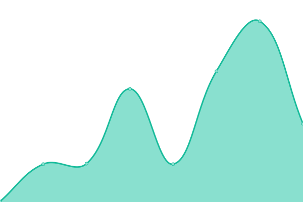

# [📈 Live Status](<[https://Pradumnasaraf.github.io/Monitoring](https://ajinghami.github.io/uptime/)>): <!--live status--> **🟧 Partial outage**

This repository contains the open-source uptime monitor for websites to track , powered by [Upptime](https://github.com/upptime/upptime).

[**Visit our status website →**](https://ajinghami.github.io/uptime/)

<!--start: status pages-->
<!-- This summary is generated by Upptime (https://github.com/upptime/upptime) -->
<!-- Do not edit this manually, your changes will be overwritten -->
<!-- prettier-ignore -->
| URL | Status | History | Response Time | Uptime |
| --- | ------ | ------- | ------------- | ------ |
|  [Google](https://www.google.com) | 🟩 Up | [google.yml](https://github.com/ajinghami/uptime/commits/HEAD/history/google.yml) | 

 91ms
     
 | 

<a href="https://ajinghami.github.io/uptime/history/google">100.00%</a>
    

|  [Wikipedia](https://en.wikipedia.org) | 🟩 Up | [wikipedia.yml](https://github.com/ajinghami/uptime/commits/HEAD/history/wikipedia.yml) | 

 209ms
     
 | 

<a href="https://ajinghami.github.io/uptime/history/wikipedia">100.00%</a>
    

|  [Anghami](https://anghami.com) | 🟩 Up | [anghami.yml](https://github.com/ajinghami/uptime/commits/HEAD/history/anghami.yml) | 

 1275ms
     
 | 

<a href="https://ajinghami.github.io/uptime/history/anghami">100.00%</a>
    

|  [Test Broken Site](https://thissitedoesnotexist.koj.co) | 🟥 Down | [test-broken-site.yml](https://github.com/ajinghami/uptime/commits/HEAD/history/test-broken-site.yml) | 

 0ms
     
 | 

<a href="https://ajinghami.github.io/uptime/history/test-broken-site">100.00%</a>
    

<!--end: status pages-->
